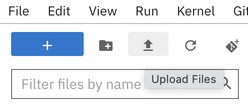
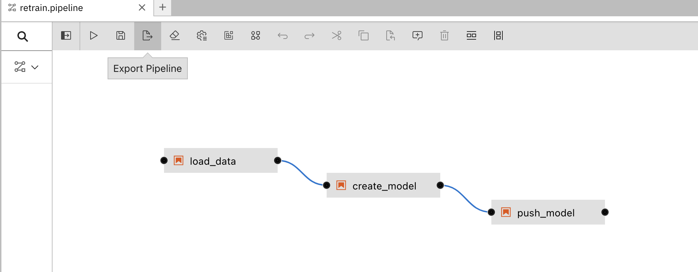
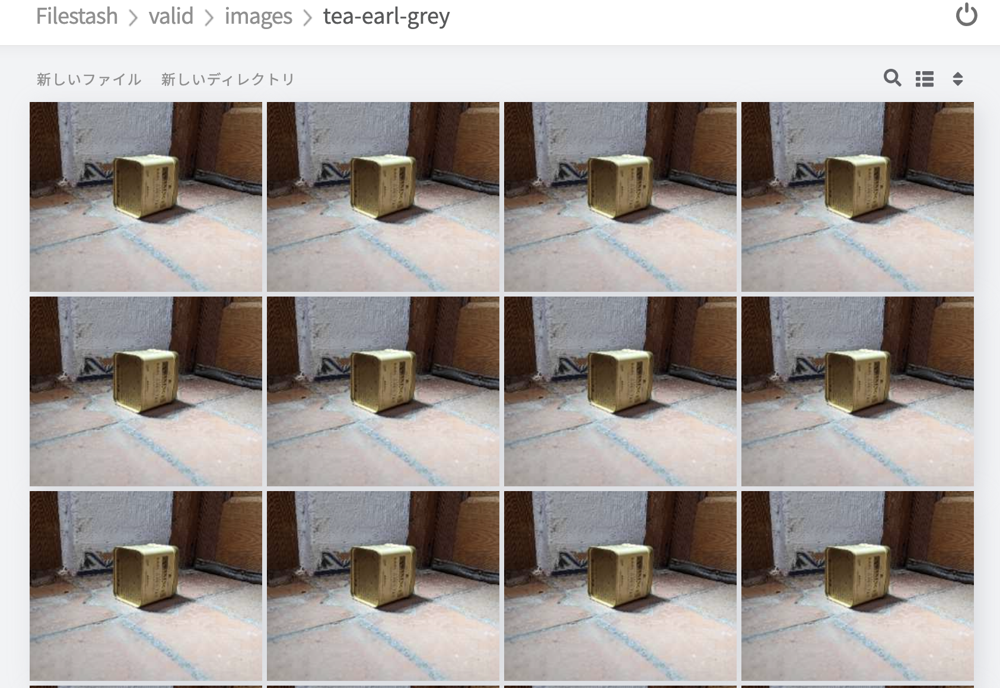

# rhods-transfer-learning

本リポジトリは、[このリポジトリ](https://github.com/brunoNetId/rhods-transfer-learning)のforkです。

本リポジトリには、エッジ側のシステムから訓練データを取得し、新しいMLモデルを学習し、学習したMLモデルをデプロイし、アプリケーションとして提供し、クライアントが推論リクエストを送るためのサービスを公開する、データの一連の流れを示すリソースが含まれています。

   > [!CAUTION]
   > このプロジェクトはまだ作成中です。以下の説明は一時的なものであり、プロジェクトの進展に伴い変更されます。

OpenShift AIのアーティファクトはYAMLでは編集できません。
以下のデプロイ手順は、面倒で時間がかかりますが、全サイクルがどのようにすべてのステージ(取得、トレーニング、配信、推論)を結びつけるかを理解できるようになります。

## テスト済みの環境

* Red Hat OpenShift AI 2.5.0 provided by Red Hat
* RHO Pipelines 1.10.4 provided by Red Hat
* AMQ-Streams 2.6.0-0 provided by Red Hat
* AMQ Broker 7.11.4 provided by Red Hat
* Red Hat build of Apache Camel 4
* Camel K 1.10 provided by Red Hat

## デプロイ手順

以下のリストは、デモを展開する手順をまとめたものです。

1. OpenShift AIのプロビジョニング
2. OpenShift AIのデータサイエンス・プロジェクトを作成
3. AI/MLパイプラインを作成し、実行する。
4. AI/MLモデルを配信し、MLサーバーを実行する。
5. パイプラインのトリガーを作成する。
6. データ取り込みシステムをデプロイする。
7. エンド・ツー・エンドでソリューションをテストする。

## Central環境の準備
### 1. OpenShift AIのプロビジョニング

   1. RHDSの[RHODS on AWS](https://demo.redhat.com/catalog?item=babylon-catalog-prod/sandboxes-gpte.ocp4-workshop-rhods-base-aws.prod&utm_source=webapp&utm_medium=share-link)を払い出します。
   2. 払い出された環境へログイン

### 2. OpenShift AIにてデータサイエンス・プロジェクトを作成

   1. MinIOのデプロイ

```bash
oc new-project central
oc apply deployment/central/minio.yaml
```

   2. 必要なS3バケットの作成
      1. MinIO UIを開く (2 routes: use _UI Route_)
      2. `minio/minio123`でログイン
      3. OpenShift AI用のバケットの作成
         1. **workbench**
      4. エッジ環境 `Edge-1` 向けのバケットを作成
         1. **edge1-data**
         2. **edge1-models**
         3. **edge1-ready**
   3. 新しい *Data Science Project* を作成
      1. *Red Hat OpenShift AI*を開く
      2. 環境へログイン
      3. *Data Science Projects* を選択して、`Create data science project`をクリック
      4. Data Science Projectの名前は `tf` (TensorFlow) とする
   4. 新しい *Data Connection* を作成
      1. 作成した `tf` プロジェクトの配下にある `Data Connections`にて `Add data connection` をクリックし、以下のパラメータを入力する：
         1. Name: `dc1` (data connection 1)
         2. Access key: `minio`
         3. Secret key: `minio123`
         4. Endpoint: `http://minio-service.central.svc:9000`
         5. Region: `eu-west-2`
         6. Bucket: `workbench`
   5. *Pipeline Server* の作成
      1. 作成した `tf` プロジェクトの配下にある `Pipelines`にて `Create a pipeline server` をクリックし、以下のパラメータを入力する：
         1. Existing data connection: `dc1`
      2. `Configure`をクリック
   6. パイプラインで使用する`*PersistentVolumeClaim*`を作成
```bash
oc create -f deployment/pipeline/pvc.yaml
```
   7. 新しい *Workbench* を作成
      1. `tf`プロジェクト > Workbenchesと遷移し、`Create workbench`をクリックして、以下の項目を入力:
         1. Name: `wb1` (workbench 1)
         2. Image selection: `TensorFlow` 
         3. Container Size: `medium` 
         4. PVを作成
            1. Name: `wb1`
            2. Persistent storage size: (default)
         5. Use a data connectionを選択
         6. Use existing data connectionを選択
            1. Data connection: `dc1`
      2. `Create workbench`をクリックします。

   8. ワークベンチが*実行*状態になったら、`開く`をクリックし、環境の認証情報を使用してログインしてください。

### 3. AI/MLパイプラインを作成し、実行する。

   1. パイプラインソースをJupyter Notebookへインポート

   > [!CAUTION] 
   > プロジェクトのアップロードに*'Git Clone'*を使わないでください。大きな画像のデータセットをアップロードする必要はありません！

   以下の画像の通り、メニューバーの下にあるアイコン`Upload Files`をクリックします。
    

  　以下のファイルをインポートします。
   * **workbench/clean-01.ipynb** 
   * **workbench/pipeline/step-01.ipynb**
   * **workbench/pipeline/step-02.ipynb**
   * **workbench/pipeline/step-03.ipynb**
   * **workbench/pipeline/retrain.pipeline** -> *Elyra* pipeline

   2. *Tekton Pipeline*のyamlファイルのエクスポート
      1. `retrain.pipeline`リソースをダブルクリックします。
      2. パイプラインが*Elyra* (Jupyterの組み込みビジュアルパイプラインエディタ)に表示されます。
      3. 以下の画像の通り、`Export Pipeline`を押下します。
         
      4. 以下の項目を入力します。
         1. s3endpoint: `http://minio-service.central.svc:9000`
         2. 他の項目はデフォルトのまま無視します。
         3. `OK`をクリック
      5. 新しく `retrain.yaml`という名前のファイルが生成されます。
      6. `retrain.yaml`内の `pipelineSpec`配下のコンテンツをコピーします。(51行目以降)
         ```
         ...
         pipelineSpec:
         ---以下以降を全てコピー--
           params:
           - name: s3bucket_data
             default: edge1-data
            ...
         ```
      7. *OpenShift Pipelines* の Pipelineリソースを作成します。
      8. `tf` project (namespace)が選択されていることを確認します。その上で、
         1. `Create > Pipeline`を選択
         2. Yamlへコピーしたコンテンツを貼り付け:
         ```yaml
         apiVersion: tekton.dev/v1beta1
         kind: Pipeline
         metadata:
         name: train-model
         namespace: tf
         spec:
         [コピーした'pipelineSpec'配下のコンテンツを貼り付け]
         ```
         > [!CAUTION] 
         > リソースを有効にするには、`pipelineSpec`定義のタブを1つ外してください。

         > [!CAUTION] 
         > 現状、Pipeline実行時にlxmlのImportエラーが出るため、各タスクへ以下を追記してください。
         > ```bash
         > ...
         > sh -c "mkdir -p ./jupyter-work-dir && cd ./jupyter-work-dir"
         > ---以下の行を各タスクのtaskSpec.steps.args配下に追記---
         > sh -c "python3 -m pip install lxml==5.1.0"
         > ---
         > sh -c "echo 'Downloading file:///opt/app-root/bin/utils/bootstrapper.py' && curl --fail -H 'Cache-Control: no-cache' -L file:///opt/app-root/bin/utils/bootstrapper.py --output bootstrapper.py"
         > ...
         > ```
      9. `Create`を押下

   パイプラインをテストするには、`Action > Start` をクリックし、デフォルト値を受け入れ、`Start` をクリックします。
   現時点ではバケットに学習用データが存在しないため、パイプラインが <u>**FAIL**</u> と表示されるはずです。

   1. MinIOへ学習用データのアップロード
      1. MinIOのUIコンソールを使って画像ファイルをアップロードします。
         1. 画像ファイルは以下のフォルダに格納されています。フォルダごとアップロードしてください。
            1. `dataset/images`
         2. `edge1-data` バケットにアップロードします。(全ての画像ファイルが完全にアップロードされるまで待ちましょう)

   2. モデルの学習
      1. すべての画像のアップロードが完了したら、`Action > Start` をクリックしてパイプラインを再実行し、デフォルトの値で `Start` をクリックします。これでパイプラインが成功するはずです。パイプラインは新しいモデルを以下のバケットにプッシュします。
         1. `edge1-models`
         2. `edge1-ready`


## *Edge1* 環境を準備
### 1. AMQ Brokerの作成
   1. 新しい *OpenShift* project `edge1`を作成
   2. *AMQ Broker*をデプロイ
      1. AMQは、エッジ・デバイスとのMQTT接続を可能にし、モニタリング・イベントを管理するために使用されます。
   3. AMQ Broker Operatorをインストール
      1. AMQ Broker for RHEL 8 (Multiarch)
         1. `edge1` namespace (specific)へインストールします。
         2. **cluster wideではありません**
   4. ***ActiveMQ Artemis*** (amq broker instance) を作成
      ``` bash
      oc apply -f deployment/edge/amq-broker.yaml**
      ```
   5. デモのモバイルアプリがアクセスするために、Routeを作成
      ```bash
      oc create route edge broker-amq-mqtt --service broker-amq-mqtt-0-svc
      ```

### 2. *Minio* の作成
   1. `edge1` namespaceを使用し、以下のYAMLをapply
      ```bash
      oc apply -f deployment/edge/minio.yaml
      ```
   2. *Minio* のUIコンソールにて以下のバケットを作成
      1. **production** (live AI/ML models)
      2. **data** (training data)
      3. **valid** (data from valid inferences)
      4. **unclassified** (data from invalid inferences)

### 3. Servie Interconnectのデプロイ

*Service Interconnect*を使用して、`Central`のS3ストレージにアクセスするローカルサービスを作成します。

   1. *Service Interconnect* のCLIをインストール
      ``` bash
      curl https://skupper.io/install.sh | sh
      export PATH="/home/user/.local/bin:$PATH"
      ```

   2. `central` namespaceで *Service Interconnect* をイニシャライズ

      ``` bash
      oc project central
      skupper init --enable-console --enable-flow-collector --console-auth unsecured
      ```

   3. `central` namespace接続用のトークンを作成
      ``` bash
      skupper token create edge_to_central.token
      ```

   4. `edge1` namespaceで *Service Interconnect* をイニシャライズ

      ``` bash
      oc project edge1
      skupper init
      ```

   5. `edge1` namespaceと`central` namespaceを接続するリンクを生成
      ``` bash
      skupper link create edge_to_central.token --name edge-to-central
      ```
   6. S3 storage service (*Minio*)を `central` namespaceから `edge1` namespaceへ公開
      ``` bash
      oc project central
      kubectl annotate service minio-service skupper.io/proxy=http skupper.io/address=minio-central
      ```
   7. 接続テスト
      ```
      oc project edge1
      oc create route edge --service=minio-central --port=port9090
      ```

新しく作成したRoute `minio-central` を使って Minio のコンソールを開いてみてください。表示されるバケットが `central` のものであることを確認してください。
サービスが正常であることを確認したら、ルートを削除できます。

## 4. AI/MLモデルを配信し、MLサーバーを実行する。

### *Edge Manager*のデプロイ
Deploy in the new `edge1` namespace. \
   Follow instructions under:
    * **camel/edge-manager/Readme.txt** 
    
    The *Edge Manager* moves available models from the `edge1-ready` (central) to `production` (edge1). \
    When the pod starts, you will see the model available in `production`.

### Deploy the TensorFlow server.

   Under the `edge1` project, deploy the following YAML resource:
      * **deployment/edge/tensorflow.yaml** 

   The server will pick up the newly trained model from the `production` S3 bucket.


1. Run an inference request.

   To test the Model server works, follow the instructions below.
   1. From a terminal window change directory to client folder:
      ```bash
      cd client
      ```
   2. Edit the `infer.sh` script and configure the `server` url with your TensorFlow server's route.

   3. Run the script:
      ```
      ./infer.sh
      ```
      The output should show something similar to:
      ```
      "predictions": ["tea-green", "0.838234"]
      ```

## 5. パイプラインのトリガーを作成する。

1. Create a Pipeline trigger.

   The next stage makes the pipeline triggerable. The goal is enable the platform to train new models automatically when new training data becomes available. 
   
   Follow the steps below to create the trigger.

   To provision the YAML resources below, make sure you switch to the `tf` project where your pipeline was created.

   1. Deploy the following YAML resource:
      * **deployment/pipeline/trigger-template.yaml**

   1. Deploy the following YAML resource:
      * **deployment/pipeline/trigger-binding.yaml**

   1. Deploy the following YAML resource:
      * **deployment/pipeline/event-listener.yaml**

2. Trigger the pipeline

   To manually test the pipeline trigger, from OpenShifts's UI console, open a terminal by clicking the icon `>_` in the upper-right corner of the screen.

   Copy/Paste and execute the following `curl` command:

    ```bash
    curl -v \
    -H 'content-Type: application/json' \
    -d '{"id-edge":"edge1"}' \
    http://el-train-model-listener.tf.svc:8080
    ```
   The output of the command above should show the status response:
    ```
    HTTP/1.1 202 Accepted
    ```
   Switch to the Pipelines view to inspect if a new pipeline execution has started.

   a. When the pipeline succeeds, a new model version will show up in the `edge1-models` S3 bucket.
   
   b. The pipeline also pushes the new model to the `edge1-ready` bucket. The *Edge Manager* moves the model to the *Edge Minio* instance, into the `production` bucket.  The Model server will detect the new version and hot reload it.

1. Deploy a Kafka cluster

   The platform uses Kafka to produce/consume events to trigger the pipeline automatically.

   1. Install the *AMQ Streams* operator in the `central` namespace.
   1. Deploy a Kafka cluster in the `central` namespace using the following YAML resource:
      * **deployment/central/kafka.yaml**
      
      Wait for the cluster to fully deploy.

1. Deploy the Camel delivery system

    This Camel system is responsible to listen for Kafka signals to trigger pipeline executions.

    Follow instructions under:
    * **camel/central-delivery/Readme.txt**

    When successfully deployed, *Camel* should connect to *Kafka* and create a *Kafka* topic `trigger`. Check in your environment *Camel* started correctly, and the *Kafka* topic exists.

    > [!CAUTION] 
    > You might need to wait a bit until the `trigger` topic gets created, be patient.


<br/>


## 6. データ取り込みシステムをデプロイする。

A *Camel* service deployed on *Central* will be ready listening for requests to ingest training data.

Upon receiving data ingestion requests, Camel will:
* Unpack the data and push it to central S3 storage.
* Send a signal via *Kafka* to kick off the process of training a new AI/ML model.

<br/>

1. Deploy the *Feeder*

    To deploy the system on *OpenShift*, follow instructions under:
    * **camel/central-feeder/Readme.txt**

    Check in your environment *Camel* has started and is in healthy state.

1. Expose the *Feeder* service to the *Service Interconnect* network to allow `edge1` to have visibility:
    ```
    oc project central
    ```
    ```
    kubectl annotate service feeder skupper.io/proxy=http
    ```


1. (for testing purposes) Expose the `feeder` service (in `edge1`) by executing the command below:

   ```bash
   oc expose service feeder -n edge1
   ```

<br/>

## 7. エンド・ツー・エンドでソリューションをテストする。

This final test validates all the platform stages are healthy. We should see the following processes in motion:

1. A client sends training data for a new product.
1. The feeder system (Camel) ingests the data, stores it in S3, and sends a trigger signal.
1. The delivery system (Camel) receives the signal and triggers the Pipeline.
1. The Pipeline trains a new model and pushes it to S3 storage.
1. The edge manager (Camel) detects a new model and moves it to local S3 storage.
1. The edge ML Server (TensorFlow) detects a new model and hot deploys it.
1. The platform has now evolved and capable of detecting the new product.

<br/>

Procedure:

1. Check the current edge model version in `production`.
   
   The `edge1` Minio S3 bucket should show model version `2` under:
   * **production/models/tea_model_b64**

1. Push training data

   From the `central-feeder` project, execute in your terminal the following `curl` command:
    > [!CAUTION] 
    > If the ZIP file is big, be patient.
   ```
   ROUTE=$(oc get routes -n edge1 -o jsonpath={.items[?(@.metadata.name==\'feeder\')].spec.host}) && \
   curl -v -T data.zip http://$ROUTE/zip?edgeId=edge1
   ```
1. When the upload completes you should see a new pipeline execution has started.

1. When the pipeline execution completes you should see a new version `3` deployed under:
   * **production/models/tea_model_b64**

1. Test the new model

   Send a new inference request against the ML Server. \
   Under the project's `client` folder, execute the script:
   ```
   ./infer.sh
   ```


<br/>

### Deploy the AI-powered (intelligent) App

The App connects edge devices to the platform and integrates with the various systems. \
It includes an interface capable of:
* Get price tags for products (inferencing)
* Send training data (data ingesting)
* Monitoring platform activity  


#### Install dependencies

Some components are Camel K based.

* Install Camel K Operator (cluster-wide)
  * Red Hat Integration - Camel K \
    1.10.5 provided by Red Hat

#### Install systems

Under the `edge1` namespace, perform the following actions:

1. Deploy the Price Engine (Catalogue).
   
   The price engine is based on Camel K. \
   From the folder:
    * **camel/edge-shopper/camel-price**

   First, create a *ConfigMap* containing the catalogue: \
   (make sure you're working on the `edge1` namespace) 
   ```
   oc create cm catalogue --from-file=catalogue.json -n edge1
   ```

   Then, run the `kamel` cli command:
    ```
    kamel run price-engine.xml \
    --resource configmap:catalogue@/deployments/config
    ```

1. Deploy the *Edge Monitor*. \
   Deploy it in the new `edge1` namespace. \
   Follow instructions under:
    * **camel/edge-monitor/Readme.txt** 
    
    The *Edge Monitor* bridges monitoring events from Kafka to MQTT.


1. Deploy the *Edge Shopper* (Intelligent App). \
   Deploy it in the new `edge1` namespace. \
   Follow instructions under:
    * **camel/edge-shopper/Readme.txt** 
    
    The *Edge Shopper* allows for inferencing/data-acquisition/monitoring from a web-based app the user can operate.

1. Create a route to enable external connectivity:
    ```
    oc create route edge camel-edge --service shopper
    ```
   Use the route URL to connect from a browser.


https://[camel-edgeのRouteのURL]/monitor.html
https://[camel-edgeのRouteのURL]/admin.html


## [おまけ] Filestashのインストール

[Filestash](https://www.filestash.app/)を使用することで、MinIO上のバケットに格納された画像ファイルを視覚的に確認することができます。

以下のようにHelmからインストールできます。

```bash
oc project edge1
helm repo add filestash https://sebagarayco.github.io/helm-filestash
helm search repo filestash
helm install filestash filestash/filestash --namespace='edge1' --set serviceAccount.name='filestash'
oc adm policy add-scc-to-user anyuid -z filestash
oc expose service filestash -n edge1
```

FilestashのRouteへアクセスし、S3への接続設定でMinIOのエンドポイントとユーザ名、パスワードを指定すると以下のようにバケット内のデータへアクセスできます。



## AKHQ
[AKHQ](https://akhq.io/)は、Kafka上のTopicに書き込まれたデータを確認できるGUIツールです。以下のようにHelmからインストールできます。

```bash
oc project central
helm repo add akhq https://akhq.io/
helm inspect values akhq/akhq
helm upgrade --install akhq akhq/akhq --set secrets.akhq.connections.my-cluster-plain-text.properties.bootstrap.servers=my-cluster-kafka-bootstrap:9092
oc expose service akhq -n central
```