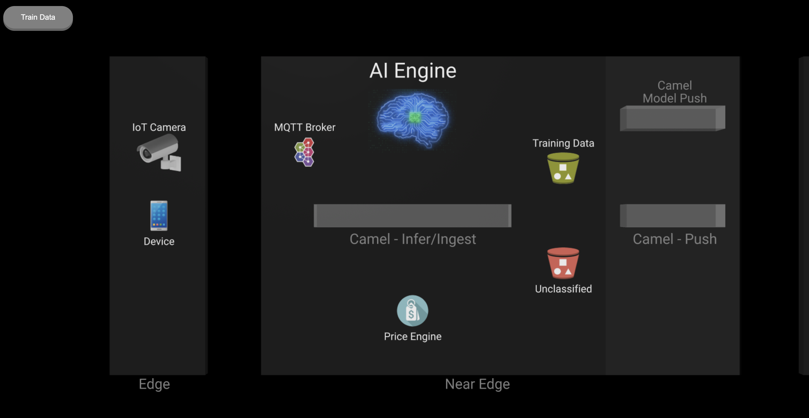
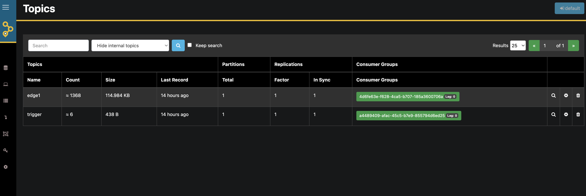

# rhods-transfer-learning

本リポジトリは、[このリポジトリ](https://github.com/brunoNetId/rhods-transfer-learning)のforkです。

本リポジトリには、エッジ側のシステムから訓練データを取得し、新しいMLモデルを学習し、学習したMLモデルをデプロイし、アプリケーションとして提供し、クライアントが推論リクエストを送るためのサービスを公開する、データの一連の流れを示すリソースが含まれています。

   > [!CAUTION]
   > このプロジェクトはまだ作成中です。以下の説明は一時的なものであり、プロジェクトの進展に伴い変更されます。

OpenShift AIのアーティファクトはYAMLでは編集できません。
以下のデプロイ手順は、面倒で時間がかかりますが、全サイクルがどのようにすべてのステージ(取得、トレーニング、配信、推論)を結びつけるかを理解できるようになります。

## テスト済みの環境

* Red Hat OpenShift AI 2.5.0 provided by Red Hat
* RHO Pipelines 1.10.4 provided by Red Hat
* AMQ-Streams 2.6.0-0 provided by Red Hat
* AMQ Broker 7.11.4 provided by Red Hat
* Red Hat build of Apache Camel 4
* Camel K 1.10 provided by Red Hat

## デプロイ手順

以下のリストは、デモを展開する手順をまとめたものです。

1. OpenShift AIのプロビジョニング
2. OpenShift AIのデータサイエンス・プロジェクトを作成
3. AI/MLパイプラインを作成
4. AI/MLモデルをデプロイ
5. パイプラインのトリガーを作成
6. データ取り込みシステムをデプロイ
7. E2Eテスト

## Central環境の準備
### 1. OpenShift AIのプロビジョニング

1. RHDSの[RHODS on AWS](https://demo.redhat.com/catalog?item=babylon-catalog-prod/sandboxes-gpte.ocp4-workshop-rhods-base-aws.prod&utm_source=webapp&utm_medium=share-link)を払い出します。
2. 払い出された環境へログイン

### 2. OpenShift AIにてデータサイエンス・プロジェクトを作成

1. MinIOのデプロイ
```bash
oc new-project central
oc apply deployment/central/minio.yaml
```

1. 必要なS3バケットの作成
   1. MinIO UIを開く (2 routes: use _UI Route_)
   2. `minio/minio123`でログイン
   3. OpenShift AI用のバケットの作成
      1. **workbench**
   4. エッジ環境 `Edge-1` 向けのバケットを作成
      1. **edge1-data**
      2. **edge1-models**
      3. **edge1-ready**

2. 新しい *Data Science Project* を作成
   1. *Red Hat OpenShift AI*を開く
   2. 環境へログイン
   3. *Data Science Projects* を選択して、`Create data science project`をクリック
   4. Data Science Projectの名前は `tf` (TensorFlow) とする

3. 新しい *Data Connection* を作成
   1. 作成した `tf` プロジェクトの配下にある `Data Connections`にて `Add data connection` をクリックし、以下のパラメータを入力する：
      1. Name: `dc1` (data connection 1)
      2. Access key: `minio`
      3. Secret key: `minio123`
      4. Endpoint: `http://minio-service.central.svc:9000`
      5. Region: `eu-west-2`
      6. Bucket: `workbench`

4. *Pipeline Server* の作成
   1. 作成した `tf` プロジェクトの配下にある `Pipelines`にて `Create a pipeline server` をクリックし、以下のパラメータを入力する：
      1. Existing data connection: `dc1`
   2. `Configure`をクリック

5. パイプラインで使用する`*PersistentVolumeClaim*`を作成
```bash
oc create -f deployment/pipeline/pvc.yaml
```

6. 新しい *Workbench* を作成
   1. `tf`プロジェクト > Workbenchesと遷移し、`Create workbench`をクリックして、以下の項目を入力:
      1. Name: `wb1` (workbench 1)
      2. Image selection: `TensorFlow` 
      3. Container Size: `medium` 
      4. PVを作成
         1. Name: `wb1`
         2. Persistent storage size: (default)
      5. Use a data connectionを選択
      6. Use existing data connectionを選択
         1. Data connection: `dc1`
   2. `Create workbench`をクリックします。

7. ワークベンチが*実行*状態になったら、`開く`をクリックし、環境の認証情報を使用してログインしてください。

### 3. AI/MLパイプラインを作成

1. パイプラインソースをJupyter Notebookへインポート

> [!CAUTION] 
> プロジェクトのアップロードに*'Git Clone'*を使わないでください。大きな画像のデータセットをアップロードする必要はありません！

   以下の画像の通り、メニューバーの下にあるアイコン`Upload Files`をクリックします。
   

   以下のファイルをインポートします。
   * **workbench/clean-01.ipynb** 
   * **workbench/pipeline/step-01.ipynb**
   * **workbench/pipeline/step-02.ipynb**
   * **workbench/pipeline/step-03.ipynb**
   * **workbench/pipeline/retrain.pipeline** -> *Elyra* pipeline

2. *Tekton Pipeline*のyamlファイルのエクスポート
   1. `retrain.pipeline`リソースをダブルクリックします。
   2. パイプラインが*Elyra* (Jupyterの組み込みビジュアルパイプラインエディタ)に表示されます。
   3. 以下の画像の通り、`Export Pipeline`を押下します。
    
   4. 以下の項目を入力します。
    5. s3endpoint: `http://minio-service.central.svc:9000`
    6. 他の項目はデフォルトのまま無視します。
    7. `OK`をクリック
   5. 新しく `retrain.yaml`という名前のファイルが生成されます。
   6. `retrain.yaml`内の `pipelineSpec`配下のコンテンツをコピーします。(51行目以降)
   ```
   ...
   pipelineSpec:
   ---以下以降を全てコピー--
   params:
   - name: s3bucket_data
      default: edge1-data
      ...
   ```


3. *OpenShift Pipelines* の Pipelineリソースを作成します。
   1. `tf` project (namespace)が選択されていることを確認します。その上で、
     1. `Create > Pipeline`を選択
     2. Yamlへコピーしたコンテンツを貼り付け:
     ```yaml
     apiVersion: tekton.dev/v1beta1
     kind: Pipeline
     metadata:
     name: train-model
     namespace: tf
     spec:
     [コピーした'pipelineSpec'配下のコンテンツを貼り付け]
     ```
   2. `Create`を押下

> [!CAUTION] 
> リソースを有効にするには、`pipelineSpec`定義のタブを1つ外してください。

> [!CAUTION] 
> 現状、Pipeline実行時にlxmlのImportエラーが出るため、各タスクへ以下を追記してください。
> ```bash
> ...
> sh -c "mkdir -p ./jupyter-work-dir && cd ./jupyter-work-dir"
> ---以下の行を各タスクのtaskSpec.steps.args配下に追記---
> sh -c "python3 -m pip install lxml==5.1.0"
> ---
> sh -c "echo 'Downloading file:///opt/app-root/bin/utils/bootstrapper.py' && curl --fail -H 'Cache-Control: no-cache' -L file:///opt/app-root/bin/utils/bootstrapper.py --output bootstrapper.py"
> ...
> ```

パイプラインをテストするには、`Action > Start` をクリックし、デフォルト値を受け入れ、`Start` をクリックします。
現時点ではバケットに学習用データが存在しないため、パイプラインが <u>**FAIL**</u> と表示されるはずです。

4. MinIOへ学習用データのアップロード
   1. MinIOのUIコンソールを使って画像ファイルをアップロードします。
      1. 画像ファイルは以下のフォルダに格納されています。フォルダごとアップロードしてください。
         1. `dataset/images`
      2. `edge1-data` バケットにアップロードします。(全ての画像ファイルが完全にアップロードされるまで待ちましょう)

5. モデルの学習
   1. すべての画像のアップロードが完了したら、`Action > Start` をクリックしてパイプラインを再実行し、デフォルトの値で `Start` をクリックします。これでパイプラインが成功するはずです。パイプラインは新しいモデルを以下のバケットにプッシュします。
      1. `edge1-models`
      2. `edge1-ready`


## *Edge1* 環境を準備
### 1. AMQ Brokerの作成
1. 新しい *OpenShift* project `edge1`を作成
2. *AMQ Broker*をデプロイ
   1. AMQは、エッジ・デバイスとのMQTT接続を可能にし、モニタリング・イベントを管理するために使用されます。
3. AMQ Broker Operatorをインストール
   1. AMQ Broker for RHEL 8 (Multiarch)
      1. `edge1` namespace (specific)へインストールします。
      2. **cluster wideではありません**
4. ***ActiveMQ Artemis*** (amq broker instance) を作成
   ``` bash
   oc apply -f deployment/edge/amq-broker.yaml**
   ```
5. デモのモバイルアプリがアクセスするために、Routeを作成
   ```bash
   oc create route edge broker-amq-mqtt --service broker-amq-mqtt-0-svc
   ```

### 2. *Minio* の作成
1. `edge1` namespaceを使用し、以下のYAMLをapply
   ```bash
   oc apply -f deployment/edge/minio.yaml
   ```
2. *Minio* のUIコンソールにて以下のバケットを作成
   1. **production** (live AI/ML models)
   2. **data** (training data)
   3. **valid** (data from valid inferences)
   4. **unclassified** (data from invalid inferences)

### 3. Servie Interconnectのデプロイ

*Service Interconnect*を使用して、`Central`のS3ストレージにアクセスするローカルサービスを作成します。

1. *Service Interconnect* のCLIをインストール
``` bash
curl https://skupper.io/install.sh | sh
export PATH="/home/user/.local/bin:$PATH"
```

2. `central` namespaceで *Service Interconnect* をイニシャライズ

``` bash
oc project central
skupper init --enable-console --enable-flow-collector --console-auth unsecured
```

3. `central` namespace接続用のトークンを作成
``` bash
skupper token create edge_to_central.token
```

4. `edge1` namespaceで *Service Interconnect* をイニシャライズ

``` bash
oc project edge1
skupper init
```

5. `edge1` namespaceと`central` namespaceを接続するリンクを生成
``` bash
skupper link create edge_to_central.token --name edge-to-central
```

6. S3 storage service (*Minio*)を `central` namespaceから `edge1` namespaceへ公開
``` bash
oc project central
kubectl annotate service minio-service skupper.io/proxy=http skupper.io/address=minio-central
```

7. 接続テスト
```
oc project edge1
oc create route edge --service=minio-central --port=port9090
```

新しく作成したRoute `minio-central` を使って Minio のコンソールを開いてみてください。表示されるバケットが `central` のものであることを確認してください。
サービスが正常であることを確認したら、ルートを削除できます。

## 4. AI/MLモデルをデプロイ
### *Edge Manager*のデプロイ

以下のコマンドを実行し、`edge1` namespaceへ `Edge Manager`をデプロイします。

```bash
cd camel/edge-manager
oc project edge1
./mvnw clean package -DskipTests -Dquarkus.kubernetes.deploy=true
```

*Edge Manager*は、使用可能なモデルを`edge1-ready`(central)バケットから`production`(edge1)バケットに移動します。
Podが起動すると、`production`バケットで利用可能なモデルが表示されます。

### TensorFlowサーバのデプロイ

以下のコマンドを実行し、`edge1` namespaceへ `Tensorflow`サーバをデプロイします。

```bash
oc project edge1
oc apply -f deployment/edge/tensorflow.yaml
```

サーバーは`production` バケットから新しくトレーニングされたモデルをピックアップします。

Modelサーバーの動作をテストするには、以下の手順に従ってください。
1. Terminalからディレクトリを`client`フォルダに変更

```bash
bash
cd client
```

2. `infer.sh` スクリプトを編集し、`server` URL に TensorFlow サーバのルートを設定

3. スクリプトを実行
```bash
./infer.sh
```

以下のような出力が表示されます。

```bash
"predictions"： ["tea-green", "0.838234"]
```

## 5. パイプラインのトリガーを作成

1. Pipeline Triggerを作成

新しいトレーニングデータが利用可能になった時に、プラットフォームが自動的に新しいモデルをトレーニングできるようにするために、OpenShift PipelinesへTriggerを設定します。

以下のステップにしたがって、Triggerを作成してください。

なお、以下の YAMLをapplyする際は、パイプラインが作成された `tf` namespace に切り替えてください。

1. Trigger Templateの作成
```bash
oc apply -f deployment/pipeline/trigger-template.yaml
```

2. Trigger Bindingの作成
```bash
oc apply -f deployment/pipeline/trigger-binding.yaml
```

3. Event Listenerの作成

```bash
oc apply -f deployment/pipeline/event-listener.yaml
```

パイプライントリガーを手動でテストするには、OpenShifts の UI コンソールから、画面右上の `>_` アイコンをクリックしてターミナルを開きます。

以下の `curl` コマンドをコピー/ペーストして実行します：

```bash
curl -v \
-H 'content-Type: application/json' \
-d '{"id-edge":"edge1"}' \
http://el-train-model-listener.tf.svc:8080
```

ステータス・レスポンスが表示されているはずです。
```
HTTP/1.1 202 Accepted
```

パイプラインビューに切り替えて、新しいパイプラインの実行が開始されたかどうかを確認します。

* パイプラインが成功すると、新しいモデルのバージョンが `edge1-models` S3 バケットに表示されます。
* パイプラインは新しいモデルを `edge1-ready` バケットにプッシュします。*Edge Manager* はモデルを *Edge Minio* インスタンスの `production` バケットに移動し、Model サーバーは新しいバージョンを検出し、ホットリロードされます。

### Kafka クラスタのデプロイ

Kafkaを使ってイベントをProduce/Consumeし、パイプラインを自動的にトリガーできるようにします。

1. `central` namespaceへ*AMQ Streams* Operatorをインストール
2. 以下のコマンドを実行し、Kafkaクラスタをデプロイ

```bash
deployment/central/kafka.yaml
```
デプロイが完了するまで数分待ちます。

### Camel Deliveryシステムのデプロイ

Camel Delivery システムは、Kafka上のイベントを消費して、指定されたエッジ環境で要求されたパイプラインを実行する *Camel* ベースのアプリケーションです。

以下のコマンドを実行して `central` namespaceへデプロイしてください。

```bash
oc project central
cd camel/central-delivery
./mvnw clean package -DskipTests -Dquarkus.kubernetes.deploy=true
```

正常にデプロイされると、*Camel* は *Kafka* に接続し、*Kafka* トピック `trigger` を作成します。*Camel* が正しく起動し、*Kafka* トピックが存在することを確認してください。

> [!CAUTION] 
> `trigger`トピックが作成されるまで少し待つ必要があるかもしれません。

## 6. データ取り込みシステムをデプロイ

データ取り込みシステム(*Feeder*)は、`central` namespace にデプロイされる*Camel*ベースのアプリケーションです。
このシステムは、データ取り込みリクエストを受信すると、以下の処理を行います。

* zipデータを解凍し、中央のS3ストレージにプッシュする。
* *Kafka*を介してイベントを送信し、新しいAI/MLモデルのトレーニングプロセスを開始

1. トレーニングデータを用意する（ZIPファイル）

 > 新しい学習用データのコレクションを作成するには、Googleで画像をブラウズし、"名前を付けて保存... "をクリックします。その後、'images(n)'という名前のファイルをすべて見つけ、以下の通り、jpgにリネームしてください。
 > ```bash
 > find . -type f -exec mv "{}" "{}.jpg"
 > ```

 `dataset` フォルダ内のデータをZIP圧縮します。

 ```bash
 cd dataset
 zip -r data.zip" images
 ```

2. ローカルで実行テスト
以下の設定ファイル内のS3のエンドポイントURLを修正してください。

```bash
vi camel/central-feeder/src/main/resources/application.properties
...
%dev.camel.component.aws2-s3.uriEndpointOverride=https://YOUR_MINIO_ROUTE
...
```

以下のコマンドをローカルで実行します。

```bash
./mvnw clean compile quarkus:dev
```

3. Openshiftへのデプロイ

```bash
oc project central
./mvnw clean package -DskipTests -Dquarkus.kubernetes.deploy=true
```

> Note:
> このサービス（フィーダー）は一般には公開されません。
> Service Interconnectは、エッジ・リージョンからのConsumeを可能にします。

4. *Feeder*を*Service Interconnect* を通じて`edge1` namespace へ公開

```bash
oc project central
kubectl annotate service feeder skupper.io/proxy=http
```

5. (テスト用に) 以下のコマンドを実行して、(`edge1` にある) `feeder` サービスを公開

```bash
oc expose service feeder -n edge1
```

## 7. E2Eテスト

この最終テストでは、プラットフォームのすべてのステージが健全であることを検証します。以下のプロセスが動いていることを確認する必要があります。

1. クライアントが新製品のトレーニングデータを送信
2. *Feeder*(Camelアプリケーション)がデータを取り込み、S3に保存し、TriggerイベントをKafkaへ送信
3. *Camel Delivery*(Camelアプリケーション)がKafka上のTriggerイベントを受信し、Pipelineをトリガー実行
4. Pipelineは新しいモデルをトレーニングし、S3ストレージにプッシュ
5. *Edge Manager*(Camelアプリケーション)が新しいモデルを検出し、ローカルのS3ストレージへ移動
6. MLサーバ(Tensorflow)が新しいモデルを検出し、ホットデプロイ
7. プラットフォームが進化し、新製品を検出できるようになる


**手順**

1. `Edge-1` namespaceにデプロイされたMinIOの`production`バケットを確認

以下のパスに、モデルバージョン`2`が表示されているはずです。

```
production/models/tea_model_b64
```

2. 学習データのプッシュ

```bash
ROUTE=$(oc get routes -n edge1 -o jsonpath={.items[?(@.metadata.name==\'feeder\')].spec.host}) && \
curl -v -T data.zip http://$ROUTE/zip?edgeId=edge1
```

3. 学習データのアップロードが完了すると、新しいパイプラインの実行が開始され流ことを確認します。

4. パイプラインの実行が完了すると、新しいモデルバージョン `3` がデプロイさレます。

```
production/models/tea_model_b64
```

5. 新しいモデルのテスト

ML Serverに対して新しい推論リクエストを送信します。
プロジェクトの `client` フォルダの下でスクリプトを実行します：
```bash
./infer.sh
```

## 8. デモアプリケーションのデプロイ

このデモアプリケーションはエッジデバイスをプラットフォームに接続し、様々なシステムと統合します。

以下のようなインターフェイスを備えています：
* 商品の値札を取得（推論）
* トレーニングデータの送信（データの取り込み）
* プラットフォームのアクティビティをモニタリング

### 依存関係のインストール

いくつかのコンポーネントがCamel-Kをベースとしているため、以下のOperatorを事前にインストールしてください。

* Install Camel K Operator (cluster-wide)
  * Red Hat Integration - Camel K \
    1.10.5 provided by Red Hat

### システムのインストール

`edge1` namespaceにて、以下の手順を実行してください。

1. *Price Engine*のデプロイ

*Price Engine*は、Camel-Kベースでデプロイされるアプリケーションです。
デプロイするには、最初に `ConfigMap`を作成してください。

```bash
cd camel/edge-shopper/camel-price
oc create cm catalogue --from-file=catalogue.json -n edge1
```

この `ConfigMap`には、商品カタログが設定されます。
次に、`kamel` CLIを使用してアプリケーションをOpenShift環境へデプロイします。

```bash
kamel run price-engine.xml \
--resource configmap:catalogue@/deployments/config
```

アプリケーションがデプロイされたらRouteを作成します。

```bash
oc expose service price-engine -n edge1
```

*Price Engine*は、`ConfigMap`に設定された商品の値段を管理するアプリケーションです。以下のように、`item: 商品名`のヘッダ付きのHTTPリクエストを送信すると、値段を

```bash
curl \
-H "item: tea-green" \
http://price-engine-edge1.apps.cluster-lv7nl.lv7nl.sandbox257.opentlc.com/price
```

2. *Edge Monitor*のデプロイ

`edge1` namespaceにて、*Edge Monitor*をデプロイします。
*Edge Monitor*は、イベントをKafkaからMQTTへブリッジするCamelアプリケーションです。

以下のコマンドを実行してデプロイしてください。

```bash
oc project edge1
cd camel/edge-monitor
./mvnw clean package -DskipTests -Dquarkus.kubernetes.deploy=true
```

3. *Edge Shopper* のデプロイ

*Edge Shopper*は、ユーザーが操作できるウェブベースのアプリケーションおんから、推論／データ取得／モニタリングを可能にするデモアプリケーションです。

まず、以下の設定のMinIOエンドポイントを修正してください。
```bash
vi camel/edge-shopper/src/main/resources/application.properties
%dev.camel.component.aws2-s3.uriEndpointOverride=https://YOUR_MINIO_ROUTE_ENDOPOINT_URL
```
`edge1` namespaceにアプリケーションをデプロイします。

```bash
oc project edge1
./mvnw clean package -DskipTests -Dquarkus.kubernetes.deploy=true
```

Podが起動したら、Routeを作成します。

```bash
oc create route edge camel-edge --service shopper
```

ブラウザを開いて以下のURLへアクセスし、デモを実施できます！
```
https://[camel-edgeのRouteのURL]/monitor.html
```

```
https://[camel-edgeのRouteのURL]/admin.html
```




## [おまけ] Filestashのインストール

[Filestash](https://www.filestash.app/)を使用することで、MinIO上のバケットに格納された画像ファイルを視覚的に確認することができます。

以下のようにHelmからインストールできます。

```bash
oc project edge1
helm repo add filestash https://sebagarayco.github.io/helm-filestash
helm search repo filestash
helm install filestash filestash/filestash --namespace='edge1' --set serviceAccount.name='filestash'
oc adm policy add-scc-to-user anyuid -z filestash
oc expose service filestash -n edge1
```

FilestashのRouteへアクセスし、S3への接続設定でMinIOのエンドポイントとユーザ名、パスワードを指定すると以下のようにバケット内のデータへアクセスできます。


## AKHQ
[AKHQ](https://akhq.io/)は、Kafka上のTopicに書き込まれたデータを確認できるGUIツールです。以下のようにHelmからインストールできます。

```bash
oc project central
helm repo add akhq https://akhq.io/
helm inspect values akhq/akhq
helm upgrade --install akhq akhq/akhq --set secrets.akhq.connections.my-cluster-plain-text.properties.bootstrap.servers=my-cluster-kafka-bootstrap:9092
oc expose service akhq -n central
```

